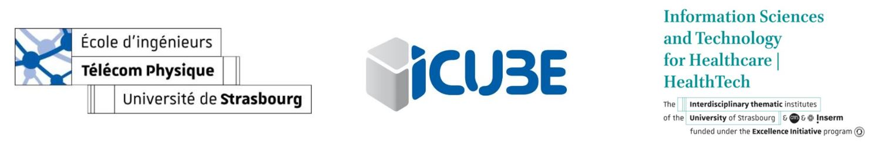

<!-- Improved compatibility of back to top link: See: https://github.com/othneildrew/Best-README-Template/pull/73 -->
<a name="readme-top"></a>
<!--
*** Thanks for checking out the Best-README-Template. If you have a suggestion
*** that would make this better, please fork the repo and create a pull request
*** or simply open an issue with the tag "enhancement".
*** Don't forget to give the project a star!
*** Thanks again! Now go create something AMAZING! :D
-->


<!-- PROJECT SHIELDS -->
<!--
*** I'm using markdown "reference style" links for readability.
*** Reference links are enclosed in brackets [ ] instead of parentheses ( ).
*** See the bottom of this document for the declaration of the reference variables
*** for contributors-url, forks-url, etc. This is an optional, concise syntax you may use.
*** https://www.markdownguide.org/basic-syntax/#reference-style-links
-->
[![LinkedIn][linkedin-shield]][linkedin-url]


<!-- PROJECT LOGO -->
<br />
<div align="center">
  <a href="https://healthtech.unistra.fr/">
    
  </a>

  <h1 align="center">Implementation of Optimization Codes</h1>

  <p align="center">
    <a href="https://github.com/Jesse-Alves?tab=repositories"><strong>View all repositories  »</strong></a>
    <br />
    <br />
  </p>
</div>


<!-- TABLE OF CONTENTS -->
<details>
  <summary>Table of Contents</summary>
  <ol>
    <li>
      <a href="#about-the-project">About The Project</a>
      <ul>
        <li><a href="#built-with">Built With</a></li>
      </ul>
    </li>
    <li>
      <a href="#getting-started">Getting Started</a>
      <ul>
        <li><a href="#prerequisites">Prerequisites</a></li>
<!--         <li><a href="#installation">Installation</a></li> -->
      </ul>
    </li>
    <li><a href="#usage">Usage</a></li>
<!--     <li><a href="#roadmap">Roadmap</a></li>
    <li><a href="#contributing">Contributing</a></li>
    <li><a href="#license">License</a></li> -->
    <li><a href="#contact">Contact</a></li>
<!--     <li><a href="#acknowledgments">Acknowledgments</a></li> -->
  </ol>
</details>


<!-- ABOUT THE PROJECT -->
## About The Project

<!--[![Product Name Screen Shot][product-screenshot]](https://example.com) -->

Currently, optimization strategies serve as pillars of progress in engineering design research and myriad other domains, shaping efficiency, precision, and innovation. In medical robotics, these methods ensure surgical precision, navigating delicate procedures within the body while minimizing invasiveness and maximizing patient outcomes. Engineering marvels, from transportation systems to sustainable energy, owe their efficiency and functionality to optimization techniques. The present work focuses on the implementation of classic optimization strategies, such as Linear Programming, Newton, Secant, Gradient descent, stepeest descent,and other algorithms within Matlab. Besides the implementaion,a report was written analyzing the results, such as convergence in local and global minimum, time and number of iterations for convergence and efficiency of the models.

Keywords: Engineering, Robotics, Optimization, Medical Field, Algorithms, Matlab.

[(Full article)](https://github.com/Jesse-Alves/Implementation-of-Optimization-Codes/blob/main/Optimization%20Report.pdf)

<!--
<p float="left">
  
<!--    
</p>
-->

<div align="center">
  <a href=" ">
    
    
  </a>
</div>


<!--
<div align="center">
  <a href="https://github.com/Jesse-Alves?tab=repositories">
    
  </a
  <a href="https://github.com/Jesse-Alves?tab=repositories">
    
  </a
    <br />
</div>
-->

<p align="right">(<a href="#readme-top">back to top</a>)</p>


### Built With
* [](https://www.mathworks.com/)

<!-- 
* [![Next][Next.js]][Next-url]
* [![React][React.js]][React-url]
* [![Vue][Vue.js]][Vue-url]
* [![Angular][Angular.io]][Angular-url]
* [![Svelte][Svelte.dev]][Svelte-url]
* [![Laravel][Laravel.com]][Laravel-url]
* [![Bootstrap][Bootstrap.com]][Bootstrap-url]
* [![JQuery][JQuery.com]][JQuery-url] -->

<p align="right">(<a href="#readme-top">back to top</a>)</p>


<!-- GETTING STARTED -->
## Getting Started

This is a Optimization Project designed in Matlab software.

### Prerequisites

All this project was built using Matlab. 
<!--This is an example of how to list things you need to use the software and how to install them.
* npm
  ```sh
  npm install npm@latest -g
  ```
  -->

<!--
### Installation

_Below is an example of how you can instruct your audience on installing and setting up your app. This template doesn't rely on any external dependencies or services._

1. Get a free API Key at [https://example.com](https://example.com)
2. Clone the repo
   ```sh
   git clone https://github.com/your_username_/Project-Name.git
   ```
3. Install NPM packages
   ```sh
   npm install
   ```
4. Enter your API in `config.js`
   ```js
   const API_KEY = 'ENTER YOUR API';
   ```

<p align="right">(<a href="#readme-top">back to top</a>)</p>
-->


<!-- USAGE EXAMPLES -->
## Usage

All the codes of the project are available [here](https://github.com/Jesse-Alves/Implementation-of-Optimization-Codes/tree/main/codes).  

More details about the project can be found in the [report](https://github.com/Jesse-Alves/Implementation-of-Optimization-Codes/blob/main/Optimization%20Report.pdf) attached.


<p align="right">(<a href="#readme-top">back to top</a>)</p>


<!-- CONTACT -->
## Contact

Jessé de Oliveira Santana Alves - [Linkedin - jessealves11](https://linkedin.com/in/jessealves11) - jessalves2@gmail.com

<p align="right">(<a href="#readme-top">back to top</a>)</p>


<!-- ACKNOWLEDGMENTS 
## Acknowledgments

Use this space to list resources you find helpful and would like to give credit to. I've included a few of my favorites to kick things off!

* [Choose an Open Source License](https://choosealicense.com)
* [GitHub Emoji Cheat Sheet](https://www.webpagefx.com/tools/emoji-cheat-sheet)
* [Malven's Flexbox Cheatsheet](https://flexbox.malven.co/)
* [Malven's Grid Cheatsheet](https://grid.malven.co/)
* [Img Shields](https://shields.io)
* [GitHub Pages](https://pages.github.com)
* [Font Awesome](https://fontawesome.com)
* [React Icons](https://react-icons.github.io/react-icons/search)

<p align="right">(<a href="#readme-top">back to top</a>)</p>
-->

<!-- MARKDOWN LINKS & IMAGES -->
[linkedin-shield]: https://img.shields.io/badge/-LinkedIn-black.svg?style=for-the-badge&logo=linkedin&colorB=555
[linkedin-url]: https://linkedin.com/in/jessealves11
